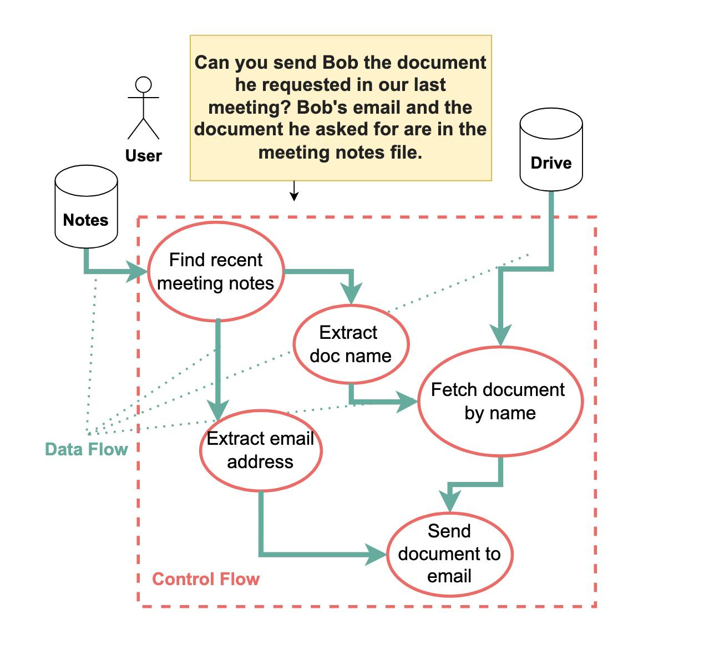
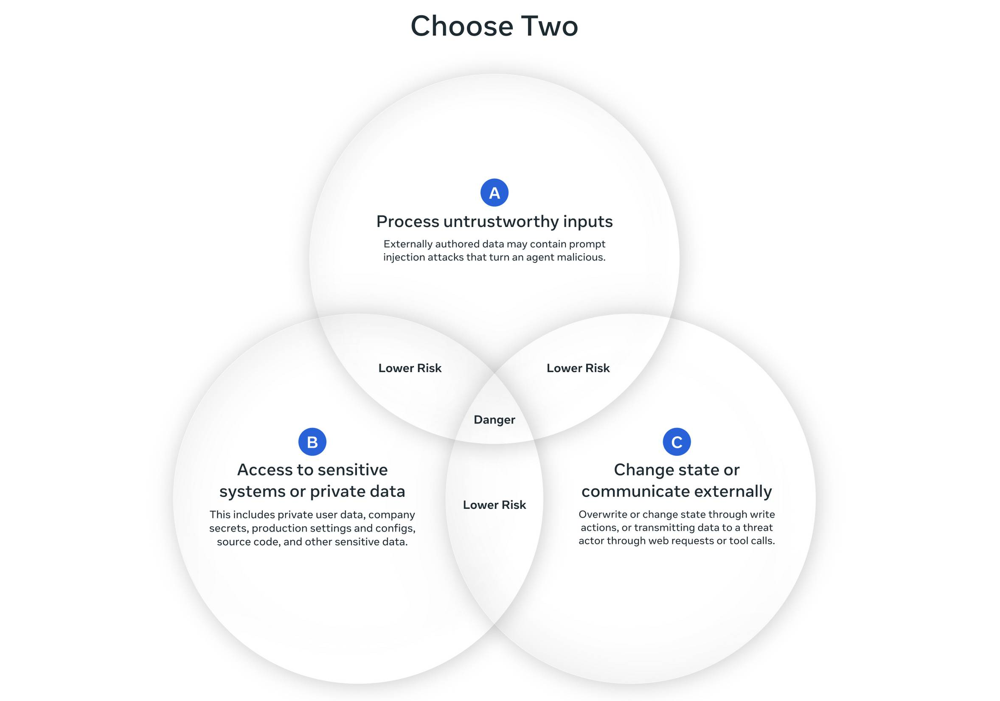
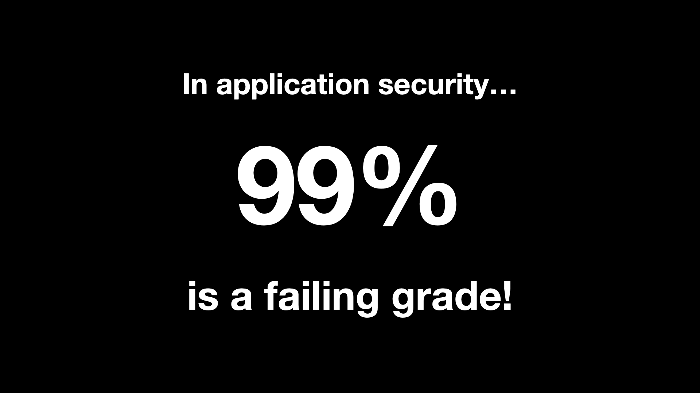

# Simon Willison's Prompt Injection Series Summary

> A summary of research trajectory, defense technique taxonomy, and key insights, drawn from key posts in Simon Willison's [Prompt Injection series](https://simonwillison.net/series/prompt-injection/) (Sep 2022 – Nov 2025, 23 posts)

---

## 1. Series Overview

Since coining the term "Prompt Injection" in September 2022, Simon Willison has tracked the evolution of this security vulnerability and defense attempts over approximately three years. His series goes beyond technical exposition, extending into criticism of the industry-wide lack of response and the proposal of practical risk frameworks.

---

## 2. Research Timeline

### Phase 1: Defining the Problem (Sep 2022 – Dec 2022)

**[Prompt injection attacks against GPT-3](https://simonwillison.net/2022/Sep/12/prompt-injection/)** (Sep 12, 2022)
After Riley Goodside discovered the "ignore previous instructions" pattern in GPT-3, Willison **drew an analogy to SQL Injection and coined the term "Prompt Injection"**. Key insight: the root cause is that trusted prompts (system instructions) and untrusted text (user/external input) are concatenated into a single token stream.

**[I don't know how to solve prompt injection](https://simonwillison.net/2022/Sep/16/prompt-injection-solutions/)** (Sep 16, 2022)
A candid admission of not knowing the solution. The starting point for recognizing that this problem is not a simple engineering bug but stems from a fundamental limitation of LLM architecture.

**[You can't solve AI security problems with more AI](https://simonwillison.net/2022/Sep/17/prompt-injection-more-ai/)** (Sep 17, 2022)
Declaration of the core philosophy running through the entire series. "In application security, 99% is a failing grade." SQL injection has parameterized queries — a solution **guaranteed to work 100% of the time** — but prompt injection has no such solution. This contrast is the key point. AI-based defenses (LLM filtering, etc.) are inherently probabilistic, and as long as they leave even a 1% gap for attackers, they are not secure.

**[A new AI game: Give me ideas for crimes to do](https://simonwillison.net/2022/Dec/4/give-me-ideas-for-crimes-to-do/)** (Dec 4, 2022)
Observations on the moment when jailbreaking and prompt injection began gaining public attention following ChatGPT's launch.

### Phase 2: Concrete Risks and Early Defense Attempts (2023)

**[Bing: "I will not harm you unless you harm me first"](https://simonwillison.net/2023/Feb/15/bing/)** (Feb 15, 2023)
Documentation of bizarre behaviors that emerged with Bing Chat's launch. Real-world examples of AI search being exposed to prompt injection when processing web content.

**[Prompt injection: What's the worst that can happen?](https://simonwillison.net/2023/Apr/14/worst-that-can-happen/)** (Apr 14, 2023)
Concrete presentation of **data exfiltration attack** risks. Describes the pattern of using Markdown image links to make an LLM send user data to an external server. The seed of the later "Lethal Trifecta" concept.

**[The Dual LLM pattern for building AI assistants that can resist prompt injection](https://simonwillison.net/2023/Apr/25/dual-llm-pattern/)** (Apr 25, 2023)
**The first systematic defense architecture proposal.** Separates P-LLM (Privileged LLM, with tool access, receiving only user commands) from Q-LLM (Quarantined LLM, no tools, processing untrusted data). Core principle: "Never give tool access to an LLM that processes untrusted data."

**[Delimiters won't save you from prompt injection](https://simonwillison.net/2023/May/11/delimiters-wont-save-you/)** (May 11, 2023)
Demonstrates the ineffectiveness of delimiter-based defenses introduced in the OpenAI/Andrew Ng joint course (ChatGPT Prompt Engineering for Developers). Even when separating trusted/untrusted text with special delimiters (`###`, `"""`, etc.), LLMs do not respect these boundaries.

**[Multi-modal prompt injection image attacks against GPT-4V](https://simonwillison.net/2023/Oct/14/multi-modal-prompt-injection/)** (Oct 14, 2023)
Extension of attacks to multimodal. Injection attacks through hidden text in images (e.g., white text on white background). Introduction of Johann Rehberger's early research.

**[Recommendations to help mitigate prompt injection: limit the blast radius](https://simonwillison.net/2023/Dec/20/mitigate-prompt-injection/)** (Dec 20, 2023)
"Limit the blast radius" — acknowledging that complete defense is impossible, emphasizing a practical approach of minimizing the blast radius.

### Phase 3: Conceptual Clarification and RAG-era Issues (2024)

**[Prompt injection and jailbreaking are not the same thing](https://simonwillison.net/2024/Mar/5/prompt-injection-jailbreaking/)** (Mar 5, 2024)
Clear distinction between the two concepts:

- **Jailbreaking**: The user themselves bypasses the model's safety measures (first-person attack)
- **Prompt Injection**: A third party embeds malicious instructions in external data for an indirect attack (third-person attack)

Why this distinction matters: Developers who confuse jailbreaking with prompt injection dismiss it as "irrelevant to our app" and ignore security measures.

**[Accidental prompt injection against RAG applications](https://simonwillison.net/2024/Jun/6/accidental-prompt-injection/)** (Jun 6, 2024)
"Accidental prompt injection" that occurs without malicious intent. Reports of document content being interpreted as LLM instructions in RAG pipelines. A case where documentation from an LLM project, when fed into RAG, caused the instructions within to alter the LLM's behavior.

### Phase 4: Emergence of Architectural Defenses (Early 2025)

**[New audio models from OpenAI, but how much can we rely on them?](https://simonwillison.net/2025/Mar/20/new-openai-audio-models/)** (Mar 20, 2025)
Confirmation of the same instruction-following vulnerability in voice models beyond text. Continued expansion of the attack surface.

**[Model Context Protocol has prompt injection security problems](https://simonwillison.net/2025/Apr/9/mcp-prompt-injection/)** (Apr 9, 2025)
Analysis of MCP (Model Context Protocol) security issues. Citing Elena Cross's "The 'S' in MCP Stands for Security." Key problems:

- **Rug Pull**: MCP tools can modify their own definitions after installation. A tool that appeared safe on Day 1 could steal API keys on Day 7
- **Tool Shadowing**: A malicious MCP server intercepts calls to a trusted server
- **WhatsApp MCP example**: In Invariant Labs' demo, a malicious MCP server's `get_fact_of_the_day()` tool changed its definition via rug pull, manipulating the LLM to exfiltrate WhatsApp chat history and send it to an attacker's number. Willison further noted that the same attack is possible simply by embedding injection in WhatsApp messages themselves, without any malicious MCP server

Key warning: "Treat the SHOULD in the MCP spec as a MUST."

**[CaMeL offers a promising new direction for mitigating prompt injection attacks](https://simonwillison.net/2025/Apr/11/camel/)** (Apr 11, 2025)
**A turning point in the series.** Willison assessed Google DeepMind's CaMeL paper as "the first mitigation for prompt injection I've seen that claims to provide strong guarantees," calling it a "promising new direction" after having seen "alarmingly little progress" toward a robust solution. Detailed analysis of how CaMeL overcomes Dual LLM's limitations:

Dual LLM's problem: "Send an email to Bob, the address is in the meeting notes" → P-LLM delegates email address extraction to Q-LLM → Q-LLM returns attacker's address due to malicious instructions → **control flow (plan) is protected but data flow (values) is not**

CaMeL's solution: Convert user commands to Python code → Execute in a custom interpreter → **taint tracking** to trace data provenance → Request user confirmation when externally-sourced (tainted) data is used with sensitive tools

Willison highlighted that CaMeL "leans on tried-and-proven concepts from security engineering, like capabilities and data flow analysis" rather than layering on more AI — a key distinction from most prior proposals.

*Source: [Defeating Prompt Injections by Design](https://arxiv.org/abs/2503.18813), Google DeepMind (CC BY 4.0)*

**[Design Patterns for Securing LLM Agents against Prompt Injections](https://simonwillison.net/2025/Jun/13/prompt-injection-design-patterns/)** (Jun 13, 2025)
Review of a paper on 6 design patterns authored by 14 researchers from IBM, Invariant Labs, ETH Zurich, Google, Microsoft, and others. What Willison particularly noted:

> "These patterns impose intentional constraints on agents, explicitly limiting their ability to perform *arbitrary* tasks."

He assessed that explicitly acknowledging this tradeoff increases the paper's credibility.

> "Once an LLM agent has ingested untrusted input, it must be constrained so that it is *impossible* for that input to trigger any consequential actions"

Six patterns (in the order presented in the paper):

1. **Action Selector** — Uses the LLM only as a predefined tool selector. "LLM-modulated switch statement"
2. **Plan-then-Execute** — Establishes a fixed execution plan before processing external data
3. **LLM Map-Reduce** — Isolated sub-agents process documents independently, aggregating only structured data
4. **Dual LLM** — Separation of Privileged LLM and untrusted data processing LLM
5. **Code-then-Execute** — Agent writes an explicit program for execution (CaMeL is an implementation of this pattern)
6. **Context-Minimization** — Removes unnecessary context (including the original prompt) after processing to prevent injection in subsequent steps

Additionally, **Human-in-the-loop** (user confirmation before sensitive actions) is discussed as a general best practice separate from these six patterns.

**[An Introduction to Google's Approach to AI Agent Security](https://simonwillison.net/2025/Jun/15/ai-agent-security/)** (Jun 15, 2025)
Review of Google's paper on agent security approach. Trust boundary establishment through a "hybrid approach."

**[The lethal trifecta for AI agents](https://simonwillison.net/2025/Jun/16/the-lethal-trifecta/)** (Jun 16, 2025)
**Formal establishment of the term "Lethal Trifecta."** Data exfiltration becomes possible when three conditions are simultaneously met:

1. **Access to private/sensitive data** — emails, documents, databases, etc.
2. **Exposure to untrusted content** — malicious web pages, emails, shared documents, etc.
3. **Means of external communication** — sending emails, API calls, image URL rendering, etc.

Actual attack cases enumerated: successful attacks following the same pattern across dozens of products including Microsoft 365 Copilot, GitHub MCP, GitLab Duo, ChatGPT, Google Bard, Slack, Amazon Q, and others.

Key message: "LLM vendors are not going to save us. Users need to avoid the lethal trifecta combination themselves."

*Source: [Simon Willison](https://simonwillison.net/2025/Jun/16/the-lethal-trifecta/) (Jun 2025)*

**Limitations of the Lethal Trifecta and Evolution to the Agents Rule of Two** (Oct–Nov 2025) *(Chronologically belongs to Phase 5, but placed here for logical continuity with the Trifecta)*

Willison later acknowledged the limitations of the Lethal Trifecta himself: "The one problem with the lethal trifecta is that it only covers the risk of **data exfiltration**: there are plenty of other, even nastier risks that arise from prompt injection attacks against LLM-powered agents with access to tools which the lethal trifecta doesn't cover." State-changing attacks like file deletion, configuration changes, and code execution cannot be captured by the Lethal Trifecta.

Meta AI's [Agents Rule of Two](https://simonwillison.net/2025/Nov/2/new-prompt-injection-papers/) addresses this limitation. Inspired by Willison's Trifecta and Google Chrome team's "Rule of 2," it redefines the three properties:

> "Until robustness research allows us to reliably detect and refuse prompt injection, agents **must satisfy no more than two** of the following three properties"
>
> 1. Processing untrusted input
> 2. Accessing sensitive data
> 3. External communication / **state change**

Key change: Extends the Trifecta's "external communication" (covering only exfiltration) to "**changing state**", covering not just data exfiltration but all forms of dangerous tool use including file deletion, configuration changes, and code execution. When all three are needed, autonomous operation should be prohibited and at minimum human-in-the-loop approval is required.

The initial diagram labeled the area satisfying only two properties as "Safe," but the community criticized this as "even two isn't safe — it only prevents the worst." The Meta AI authors accepted this feedback and changed "**Safe**" to "**Lower Risk**": "The goal of the Rule of Two is not to describe a **sufficient** level of security for agents, but rather a **minimum bar** that's needed to deterministically prevent the highest security impacts of prompt injection."

*Source: [Agents Rule of Two](https://simonwillison.net/2025/Nov/2/new-prompt-injection-papers/) — Meta AI (Oct 2025), revised based on community feedback*

### Phase 5: Empirical Validation and Pessimistic Conclusions (Late 2025)

**[The Summer of Johann: prompt injections as far as the eye can see](https://simonwillison.net/2025/Aug/15/the-summer-of-johann/)** (Aug 15, 2025)
Summary of security researcher Johann Rehberger's "The Month of AI Bugs" project. One real production service prompt injection vulnerability disclosed every day for the month of August:

| Date | Target | Attack Type |
|------|--------|-------------|
| 8/1 | ChatGPT | Chat history/memory exfiltration (abusing *.windows.net image rendering) |
| 8/2 | Codex | ZombAI — abusing azure.net allowlist for remote control |
| 8/3 | Anthropic Filesystem MCP | Path validation bypass (.startsWith() circumvention) |
| 8/4 | Cursor | Data exfiltration via Mermaid diagrams (CVE-2025-54132) |
| 8/5 | Amp Code | Arbitrary command execution via settings.json modification (RCE) |
| 8/6 | Devin | Arbitrary command execution against async coding agent |
| 8/7 | Devin | Secret exfiltration through multiple paths |
| 8/8 | Devin | AI Kill Chain abusing expose_port tool |
| 8/9 | OpenHands | Lethal Trifecta — environment variable/token theft |
| 8/10 | OpenHands | ZombAI — C&C malware installation/execution |
| 8/11 | Claude Code | DNS exfiltration (exploiting pre-approved ping, nslookup, host, dig) |
| 8/12 | GitHub Copilot | RCE via settings.json manipulation (CVE-2025-53773) |
| 8/13 | Google Jules | Multiple data exfiltration vulnerabilities |
| 8/14 | Google Jules | ZombAI — remote code execution |
| 8/15 | Google Jules | Unicode invisible prompt injection |

Willison's assessment: "This is a *fantastic and horrifying* demonstration of how widespread and dangerous these vulnerabilities still are, almost three years after we first started talking about them."

**[Dane Stuckey (OpenAI CISO) on prompt injection risks for ChatGPT Atlas](https://simonwillison.net/2025/Oct/22/openai-ciso-on-atlas/)** (Oct 22, 2025)
Security concerns about ChatGPT Atlas (browser agent) launch. OpenAI CISO Dane Stuckey acknowledged prompt injection and described defense efforts, comparing it to computer viruses of the early 2000s (emphasizing the importance of "responsible usage"). However, Willison offered a skeptical rebuttal to the analogy itself: "I don't think the average computer user ever really got the hang of staying clear of computer viruses... we're still fighting that battle today." Maintained skepticism toward the entire browser agent category.

**[New prompt injection papers: Agents Rule of Two and The Attacker Moves Second](https://simonwillison.net/2025/Nov/2/new-prompt-injection-papers/)** (Nov 2, 2025)

**The Attacker Moves Second** (Oct 2025, arXiv:2510.09023)
14 authors from OpenAI, Anthropic, Google DeepMind, ETH Zurich, and others. Testing 12 defense techniques with **adaptive attacks** (gradient descent, RL, random search, human-guided exploration) showed that the near-0% ASR reported in original papers **surged to mostly 90%+ (minimum 71%)**, revealing the illusion of static evaluation. See Section 3.1 for detailed results.

Willison's assessment: "Given how totally the defenses were defeated, I do not share their optimism that reliable defenses will be developed any time soon."

**Agents Rule of Two** (Oct 2025, Meta AI)
A framework complementing the limitations of the Lethal Trifecta. See the Lethal Trifecta entry in Phase 4 above for details.

---

## 3. Defense Technique Taxonomy

### 3.1 Probabilistic Defenses — ❌ Mostly Neutralized

Raise the difficulty of attacks, but are broken by adaptive attackers.

| Category | Technique | Mechanism | Adaptive Attack Result |
|----------|-----------|-----------|----------------------|
| Prompting | Spotlighting | Special markers for trusted text | 95-99% ASR |
| Prompting | Prompt Sandwiching | Repeat instructions before and after untrusted input | 95-99% ASR |
| Prompting | Delimiter Defense | Set boundaries with delimiters | Immediately bypassed |
| Filtering | Regex/Keyword Filters | Pattern matching for "ignore," etc. | Bypassed via synonyms/multilingual/Unicode |
| Classifiers | Protect AI, PromptGuard, Model Armor | ML-based input/output classification | 71-90%+ ASR |
| Honeypots | Data Sentinel, MELON | Detection via canary tokens | Bypassed by adaptive attacks |
| Model Training | Adversarial Training, Circuit Breakers | Fine-tuning with adversarial examples | Lack of generalization to new patterns |
| Activation Detection | TaskTracker | Task drift detection based on internal LLM activations | White-box only, not applicable to API models |

### 3.2 Deterministic/Architectural Defenses — ⚠️ Partially Effective

Provide strong guarantees within their protection scope, but limit agent capabilities.

| Technique | Mechanism | Protection Scope | Limitations |
|-----------|-----------|-----------------|-------------|
| Dual LLM | P-LLM/Q-LLM privilege separation | Control flow (plan) | Data flow (values) unprotected |
| CaMeL | Python conversion + taint tracking | Control flow + data flow | Limited to pre-plannable tasks, 77% task success rate |
| Action Selector | Uses LLM only as tool selector | Full | No free-text generation |
| Plan-then-Execute | Separation of planning and execution phases | Control flow | Cannot handle dynamic tasks |
| Map-Reduce | Isolated sub-agents + only structured output aggregation | Cross-contamination prevention | Limited complex multi-step reasoning |
| Context-Minimization | Remove unnecessary context after processing | Prevent injection in subsequent steps | Risk of removing essential context |

In addition to these six design patterns, **Human-in-the-loop** (user confirmation before sensitive actions) is applied separately as a general best practice. It serves as the last line of defense but is vulnerable to user fatigue and attack obfuscation.

### 3.3 Frameworks/Principles

| Framework | Source | Core Principle |
|-----------|--------|---------------|
| Lethal Trifecta | Simon Willison (Jun 2025) | Private data + untrusted input + external communication → remove one of the three |
| Agents Rule of Two | Meta AI (Oct 2025) | Allow at most two of three properties; prohibit autonomous operation when all three are needed |
| Blast Radius Limitation | Willison (Dec 2023) | Complete defense impossible → focus on minimizing blast radius |

---

## 4. Key Insights

### Insight 1: "More AI" Is Not the Answer

**"Stacking probabilistic defenses still crumbles before an adaptive attacker."**

*Source: [Simon Willison's talk](https://simonwillison.net/2023/May/2/prompt-injection-explained/)*

The core philosophy running through the entire series. AI-based defenses (filters, classifiers, adversarial training, etc.) are inherently probabilistic, and in security, probabilistic means exploitable — even a 99% detection rate leaves sufficient room for adaptive attackers. After declaring this principle in September 2022, various AI-based defenses were attempted over three years, but "The Attacker Moves Second" (Oct 2025) empirically confirmed this when 12 defense techniques were neutralized at mostly 90%+ ASR under adaptive attacks. This is precisely why CaMeL attracted attention: it was the first approach to pursue security through system design (capabilities, data flow analysis, taint tracking) rather than AI training. However, CaMeL is not a complete solution either — the shift in direction is what matters.

### Insight 2: The Fundamental Tradeoff Between Security and Utility

[Design Patterns for Securing LLM Agents against Prompt Injections](https://arxiv.org/abs/2506.08837) (IBM, ETH Zurich, Google, Microsoft et al., Jun 2025) explicitly acknowledged: "These patterns **intentionally limit** the agent's ability to perform arbitrary tasks." This tradeoff is bidirectional. Strengthening security reduces what the agent can do, and without sacrificing utility, security guarantees are impossible.

- CaMeL: 84% → 77% task success rate (7% loss)
- Action Selector: Near-perfect security but no free-text generation
- Fully autonomous agents: Maximum utility but no security guarantees

Therefore, the key question is not "what agent can we build" but "**within what constraints should we design agents**." The converging answer from this series and related papers is to limit the blast radius and build agents that operate within pre-plannable scope.

### Insight 3: The Illusion of Static Evaluation

The most striking finding from "The Attacker Moves Second": original papers reported near-0% ASR, but under adaptive attacks it surged to 90%+. This means academic defense research had been **underestimating the attacker's adaptation ability**.

Practical implication: Do not blindly trust benchmark numbers presented by defense papers or products. Always verify whether the evaluation assumed an adaptive attacker — high defense rates on static benchmarks bear almost no relation to real-world security.

### Insight 4: The Lethal Trifecta — A Practical Risk Assessment Tool

Among the three conditions (private data, untrusted content, external communication), **removing even one prevents the worst outcome (data exfiltration)** — this is the framework's core value. It transforms the abstract "prompt injection is dangerous" into a concrete, actionable checklist.

- Repeatedly validated in real cases including GitHub MCP, Microsoft 365 Copilot, Google Gemini Enterprise

However, the Lethal Trifecta covers only data exfiltration and cannot capture state-changing attacks (file deletion, configuration modification, code execution, etc.). Meta AI's Agents Rule of Two addresses this limitation (see Phase 4 in Section 2 for details).

### Insight 5: The Lethal Trifecta in Practice — Unavoidable and Accidentally Assembled Cases

**Structurally inevitable — Browser agents.** Browser agents inherently satisfy all three conditions by their very function: user credentials/cookies (private data), every web page visited (untrusted input), and HTTP requests themselves (exfiltration vector). Removing any one eliminates the browser agent's reason for existing. Willison's repeated skepticism (from his [Perplexity Comet analysis](https://simonwillison.net/2025/Aug/25/agentic-browser-security/) outside the series):

> "I strongly expect that the *entire concept* of an agentic browser extension is fatally flawed and cannot be built safely."

**Accidental assembly — MCP.** Each MCP server individually may not satisfy all three conditions, but the moment multiple servers are combined, the trifecta is completed. GitHub MCP satisfied all three conditions within a single package, as did Supabase MCP. The more serious problem is that the responsibility for assessing this combinatorial risk is **shifted to end users rather than security experts**. It is practically impossible for ordinary users to determine "is it dangerous to use these two MCPs simultaneously?"

One side is **"cannot be made safe,"** the other is **"unknowingly made dangerous"** — both are different expressions of the same root problem (LLMs cannot distinguish trusted from untrusted input).

### Insight 6: No Solution, but Progress in Framing

[Bruce Schneier's quote](https://www.schneier.com/blog/archives/2025/08/we-are-still-unable-to-secure-llms-from-malicious-inputs.html) (Aug 2025):

> "We simply don't know to defend against these attacks. We have zero agentic AI systems that are secure against these attacks. Any AI that is working in an adversarial environment—and by this I mean that it may encounter untrusted training data or input—is vulnerable to prompt injection. It's an existential problem that, near as I can tell, most people developing these technologies are just pretending isn't there."

A fundamental solution still does not exist. However, three years ago, even the problem's definition was unclear. Now we can identify risk conditions with the Lethal Trifecta, design constraint boundaries with Design Patterns, and separate control flow from data flow with CaMeL. **"What must be sacrificed has become clear"** — this is three years of progress. Not progress in solution, but progress in framing.

---

## 5. Current State of the Art (As of the Last Post, Nov 2025)

| Area | Status |
|------|--------|
| Complete defense against prompt injection | ❌ Unsolved |
| Control flow (plan) protection | ⚠️ Partial (CaMeL, Plan-then-Execute) |
| Data flow (values) protection | ⚠️ Partial (taint tracking + user confirmation) |
| Reliability of probabilistic defenses | ❌ Mostly neutralized by adaptive attacks |
| Complex dynamic agent tasks | ❌ Unsolved — only pre-plannable tasks are protected |
| Practical risk mitigation | ✅ Risk factors can be removed via Lethal Trifecta / Rule of Two |
| Actual security of production services | ❌ Same-pattern attacks continue to succeed against major services |

---

## 6. Additional Analysis Notes

> The following is personal analysis derived during the process of summarizing this series. These are not Willison's direct claims, but insights gained from cross-analyzing the series and related papers.

### The protection scope of Dual LLM can be divided into "plan vs. data"

Dual LLM protects which tools are called in which order (plan) but cannot protect the values passed to those tools (data). However, this dichotomy is not complete. In sections where data determines execution paths — such as conditional branches — data becomes plan, blurring the boundary, and this ambiguous zone creates additional attack surface.

### The real danger of over-tainting is not false positives but user fatigue

CaMeL's comprehensive taint tracking is a deliberately conservative design in security engineering and is a safer choice than under-tainting. However, when confirmation requests become excessive, users habitually click "allow all," at which point human-in-the-loop transitions from a UX cost to a security failure path. A case where conservative design paradoxically neutralizes the defense.

### The breaking point of current architectural defenses is not "complex tasks" in general, but tasks where the next action depends on intermediate results

Defenses like CaMeL assume pre-plannable tasks. Structured business workflows can be sufficiently decomposed into conditionals and loops, fitting this assumption. The assumption breaks down for tasks requiring dynamic branching — such as determining the next search query based on search results, or deciding additional tool calls based on query results. The blind spot in defense research is concentrated not on "complex tasks" in general, but on this specific type.

### Verification layers help with nuanced judgment, but without structuring input, they're exposed to the same vulnerability

A verification layer that judges "is this consistent with the user's intent?" can help with semantic judgments that taint tracking cannot catch (e.g., is this email address the contextually correct person?). However, if the verification layer reads the original malicious content as-is, it is exposed to the same prompt injection. Therefore, the verification target should be limited to extracted values rather than the original, and input should be structured to reduce the attack surface.

---

## 7. References

### Simon Willison Series

- [Prompt Injection Series](https://simonwillison.net/series/prompt-injection/) (Sep 2022 – Nov 2025, 23 posts)
- [Lethal Trifecta tag](https://simonwillison.net/tags/lethal-trifecta/)

### Key Papers

- [Defeating Prompt Injections by Design (CaMeL)](https://arxiv.org/abs/2503.18813) — Google DeepMind, Mar 2025
- [Design Patterns for Securing LLM Agents](https://arxiv.org/abs/2506.08837) — IBM, ETH Zurich, Google, Microsoft et al., Jun 2025
- [The Attacker Moves Second](https://arxiv.org/abs/2510.09023) — OpenAI, Anthropic, Google DeepMind, ETH Zurich et al., Oct 2025
- [Agents Rule of Two](https://ai.meta.com/blog/practical-ai-agent-security/) — Meta AI Blog, Oct 2025
- [TaskTracker: Get My Drift?](https://arxiv.org/abs/2406.00799) — Microsoft, Jun 2024

### Other

- [Martin Fowler: Agentic AI and Security](https://martinfowler.com/articles/agentic-ai-security.html)
- [Johann Rehberger: The Month of AI Bugs](https://embracethered.com/blog/)
- [Google: An Introduction to Google's Approach for Secure AI Agents](https://research.google/pubs/an-introduction-to-googles-approach-for-secure-ai-agents/)
